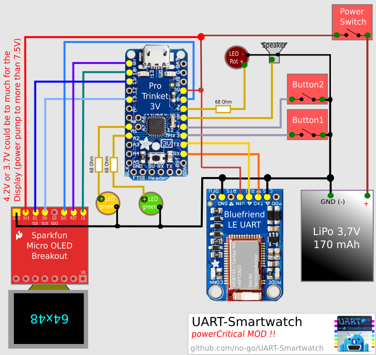

# UART-Smartwatch

This branch is a bit different than the master. Firmware and circuit are
modified to display the power of the LiPo better.

## The Firmware

Is full with my private mods.

## Circuit

The 3.3V regulator (BAT Pin) is be IRGNORED! This means, that the OLED Display
get 4.2V (a 3.7V LiPo could do that) INSTEAD of 3.3V ! This could break
the display!

[UART-Smartwatch Circuit PDF](https://raw.githubusercontent.com/no-go/UART-Smartwatch/powerCritical/stuff/UART-Smartwatch.pdf)
