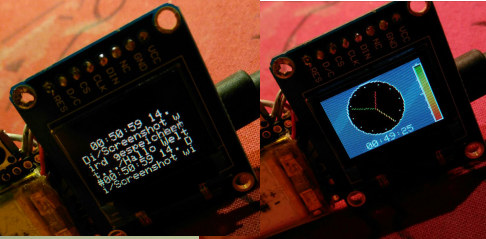

# UART-Smartwatch

This Branch:

- feather M0 bluefruit (similar to Arduino Zero)
- using timer IRQ to count seconds
- display/Clock always on
- hardware SPI for oLED RGB (16bit) SSD1331
- 1 Button to get time and messages (set 11 to low/gnd)
- Powerbar with green,yellow,red shade
- analog with digital clock

Maybe: scrolling is to slow or to fast :-/

## Android App

Get my App to send notifications via Bluetooth to this watch.

[UART-Smartwatch APK](https://raw.githubusercontent.com/no-go/UART-Smartwatch/master/UART-Smartwatch_App/app/app-release.apk) or get the App from [f-Droid](http://f-droid.org) or the Mini Version from [google play](https://play.google.com/store/apps/details?id=click.dummer.UartSmartwatch)

## Missing

- Message counting
- RGB LED Notification
- App icon?
- save power / display off or sleep
- Dino-Game
- circuit
