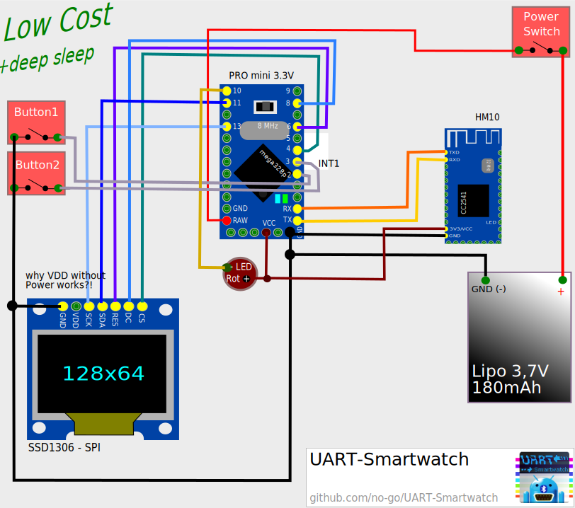

# UART-Smartwatch

This branch is a bit different than the master. Firmware and circuit are
modified.

## The Firmware

Is full with my private mods.

## Feature

- Button 1: time and message request
- Button 1 (hold it until Time Mode exits): next time, you press Button 2, you have a other Time mode
- Button 2: shows Time
- Button 2 (more than 4sec pressed): start Dino Game
- Dino game: Button 2 for jump, 3 lives, 6 speed levels, stores Highscore in EEPROM
- receive RGB Notification and message count

### Time Modes

- Digital (4sec)
- Analoge (4sec)
- Digital for ever

## Count, RGB, Blink

Send a % followed by a byte (char 0 = 0 new messages, char '0' = 48 new messages).
The 3 next Bytes should be 3 ASCII charaters. 'A' is 0 and 'z' is 57. This range is
mapped from 27-255 to set a RGB value. The last byte is a char from A-I. A=0=no blinking,
B=1 is 100ms on and 900ms of. H=8 is 800ms on and 200ms off ...

%count,R,G,B,blink(A-I is 0-9, 0 is always on)

## Circuit

