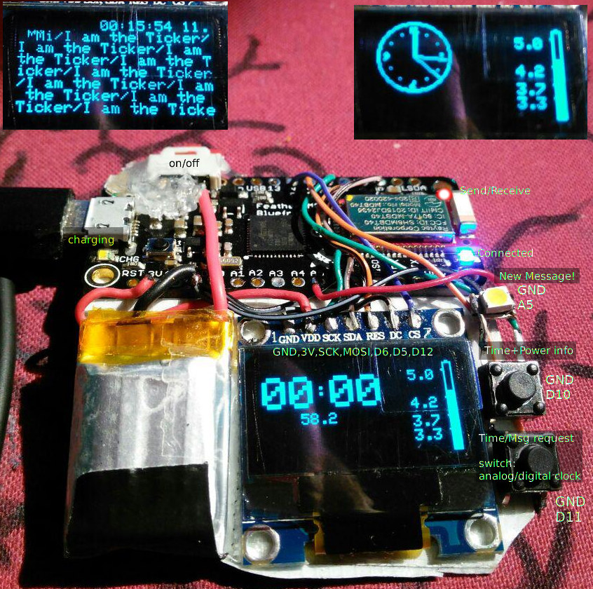

# UART-Smartwatch

This branch is a bit different than the master. Firmware and circuit are
modified. A big oled Display (SSD1306 Chip) is used and
a feather M0 bluefruit (similar to Arduino Zero).

