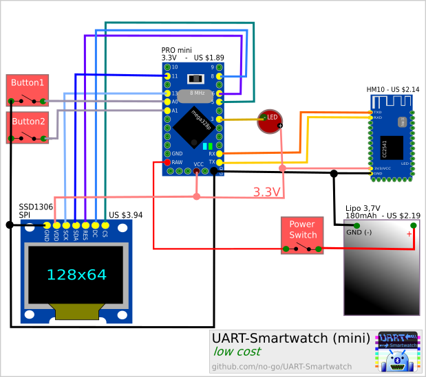

# UART-Smartwatch (mini)

Android App, Firmware and Circuit for a DIY Smartwatch working with Bluetooth Low Energy (4.x)

This branch is a bit different than the master. Firmware and circuit are modified for a low cost version.

Get a PDF (german) about my [UART Smartwatch Project](https://github.com/no-go/UART-Smartwatch/tree/gplay) from here:
 or as [Website](https://github.com/no-go/Android-nRF-UART/tree/master/Slides)

## App

The UART Smartwatch (mini) App is a smaller and easier version of the non-mini App.

You can optionaly get a signed APK from here: [UART-Smartwatch (mini) APK](https://raw.githubusercontent.com/no-go/UART-Smartwatch/gplay/UART-Smartwatch_App/app/app-release.apk)

Support me: 

## The Firmware

[UART-Smartwatch / Arduino IDE](https://raw.githubusercontent.com/no-go/UART-Smartwatch/gplay/UART-Smartwatch_firmware/UART-Smartwatch_firmware.ino)

## Features

- blinking LED, if a new notification is present
- 250 chars notification buffer
- Button 1: get a fresh time and the notification buffer from your smart phone
- Button 2: display the time and power level for 5 seconds
- Button 2 (press for more than 5 seconds): switch to a different time mode
- runs for about 6h
- Posibility to compile with DINO GAME !!! (Press both buttons)

### Time Modes

- Digital (5sec)
- Analoge (5sec)
- PitBoy Clock design (5sec)
- Digital for ever

## Circuit

**Attention!** You need a serial USB device (less than US 4$) to store the firmware on the ProMini chip. You need a small circuit (less tan US 1$ on aliexpress) to load the Lithium polimere akku (Lipo).

## License

I publish everything under the free BSD-3 License.

## Privacy policy

Google Play requires me to disclose this App will take access to your position and notifications. The your position and notifications are not send to any one. The Bluetooth Low Energy needs access to position data - I do not know, why. Your notifications are only send to your bluetooth device / UART Smartwatch and this data may be sniffed by hackers.
