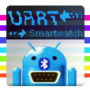
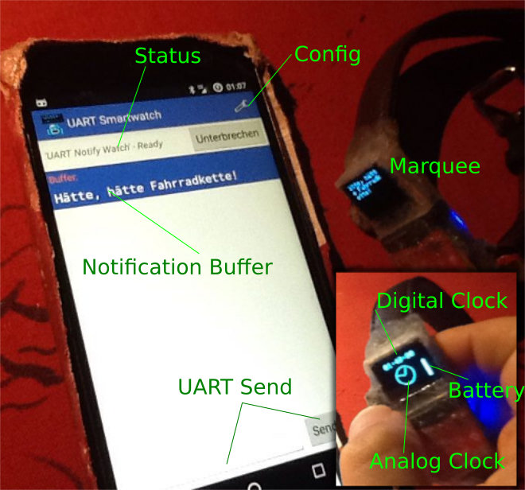
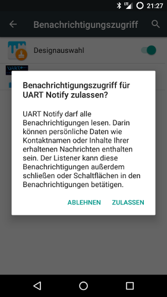

# UART-Smartwatch

Android App, Firmware and Circuit for a DIY Smartwatch working with Bluetooth Low Energy (4.x)

Features:

- Press Button 1.5 s : sync the time between watch and phone. Show date and notifications as scrolling chars.
- Press Button 0.5 s : show the time calculated by the watch. Show the battery level and an analog clock
- small analog clock
- digital clock
- Battery Level
- about 18 hours with LiPo 3.7V (170mA)
- some emoticons works
- transmit more than 20 bytes

The DIY smartwatch shows a calculated time without a connection to your phone. This time is a bit faster to pretent problems. It is about 1 second in 6 hours.

Support me: 

Get a PDF (german) about my [UART Smartwatch Project](https://github.com/no-go/UART-Smartwatch/tree/gplay) from here:
 or as [Website](https://github.com/no-go/Android-nRF-UART/tree/master/Slides)

## App

[UART-Smartwatch APK](https://raw.githubusercontent.com/no-go/UART-Smartwatch/master/UART-Smartwatch_App/app/app-release.apk) or get the App from [f-Droid](http://f-droid.org)

### Location Access

It is strange, but Bluetooth Low Energy with Android 6 needs Location access to search for BLE devices.

### Notification Access

This App needs access to all notifications. You have to add these access in the preferences of your Smartphone:

## Firmware / Smartwatch

[UART-Smartwatch / Arduino IDE](https://raw.githubusercontent.com/no-go/UART-Smartwatch/master/UART-Smartwatch_firmware/UART-Smartwatch_firmware.ino)

### Circuit

Devices:

- [Adafruit Bluefruit LE UART Friend](https://learn.adafruit.com/introducing-the-adafruit-bluefruit-le-uart-friend)
- [Micro OLED Breakout](https://github.com/sparkfun/Micro_OLED_Breakout)
- [Pro Trinket 3V](https://learn.adafruit.com/introducing-pro-trinket)
- LiPo 3,7V (170mAh)

### Startlogo

In `stuff/` is a small c program to make you own Smartwatch startup logo:

- make a 64x48 s/w Image
- store it as xbm file (e.g. with Gimp) without x10 option
- copy the content into the code
- compile and execute the code
- copy the printed output
- open: Arduino/libraries/Micro_OLED_Breakout/src/SFE_MicroOLED.cpp
- paste it into / replace the hex-chars of `static uint8_t screenmemory [] = {...}`
- rebuild the UART-Smartwatch Firmware with Arduino IDE

# Sign Of Gratitude

Thank you to [NORDIC SEMICONDUCTOR](http://www.nordicsemi.com/) for the OpenSource App like [nRF UART v2](https://github.com/NordicSemiconductor/Android-nRF-UART) to make it easy to use their products!!
